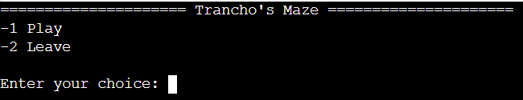
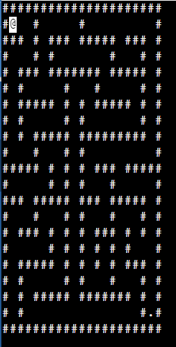

# Maze Generation

Hello everyone, this is a little project made in the purpose of my studies in ESGI.\
[Link to the Git](https://github.com/jordan95v/maze_c)

## Workflow

To run this code, please go to [OnlineGBD](https://www.onlinegdb.com/), you won't be able to run otherwise, except if you have the curses libraries installed on your computer.

## How to play

This is pretty easy, just select the first option in the menu.\

The script generate a random maze each time you play, so you never do the same maze twice !

To win, it's pretty straightfoward, you start at the top left corner (@) and you have to go the the bottom left corner, where the dot is.\

# Thanks for reading !
